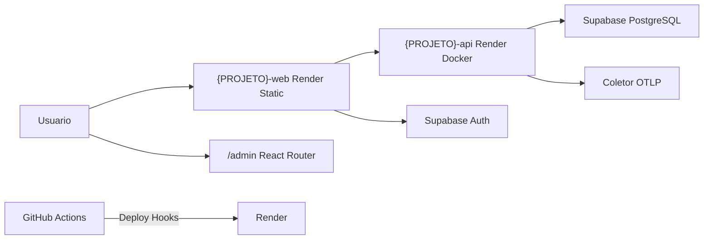

# Guia completo de setup e deploy

Playbook reutilizável para projetos com a stack padrão Capi Studio: **React + Spring Boot + Supabase + Render + GitHub Actions + OpenTelemetry**.

Substitua os placeholders abaixo antes de seguir:

| Placeholder | Descrição | Exemplo (Capi Studio) |
|-------------|-----------|------------------------|
| `{PROJETO}` | Nome curto do serviço no Render e scripts | `capistudio` |
| `{DOMINIO}` | Domínio de produção (apex) | `capistudio.com` |
| `{GITHUB_USER}` | Usuário ou org no GitHub | `thorello` |
| `{SUPABASE_REF}` | ID do projeto Supabase | `fdxbvjocdhrkzraepmwi` |
| `{RENDER_APEX_IP}` | IP do load balancer Render para registro A | `216.24.57.1` |

---

## Checklist copiável

Copie esta lista para cada novo projeto e marque conforme avança:

```markdown
### Infraestrutura base
- [ ] Monorepo com frontend/, backend/, supabase/, render.yaml, .env.example
- [ ] backend/Dockerfile (multi-stage Maven → JRE)
- [ ] .github/workflows/ci.yml (build frontend + testes backend)
- [ ] .github/workflows/deploy.yml (deploy hooks Render)
- [ ] .gitignore cobre .env, node_modules/, target/

### Supabase
- [ ] Projeto criado em supabase.com
- [ ] Migration 001 aplicada (tabelas + RLS base)
- [ ] Migration 002 aplicada (RLS admin, se houver painel)
- [ ] Connection string JDBC (pooler) configurada no Render
- [ ] Auth: site_url e redirect URLs com {DOMINIO} e /admin
- [ ] Google OAuth habilitado (se houver login admin)

### Backend
- [ ] Spring Boot 3.3.7 + Java 21
- [ ] micrometer-tracing-bridge-otel (não opentelemetry-spring-boot-starter)
- [ ] Hikari initialization-fail-timeout: -1
- [ ] management.health.db.enabled: false
- [ ] CORS com localhost + domínios de produção
- [ ] Testes CI com H2 + OTEL desabilitado

### Frontend
- [ ] Build Vite com VITE_* no Render
- [ ] npm install no buildCommand (Render)
- [ ] Node 22 no CI
- [ ] React Router com rotas /admin
- [ ] Rewrite SPA configurado no Render

### Render
- [ ] Blueprint sincronizado a partir de render.yaml
- [ ] Serviço {PROJETO}-api (Docker) com health check /actuator/health
- [ ] Serviço {PROJETO}-web (Static Site)
- [ ] Domínios api.{DOMINIO} e {DOMINIO} declarados
- [ ] Secrets: SUPABASE_DB_*, VITE_SUPABASE_*, OTEL_* (opcional)
- [ ] Rewrite /* → /index.html verificado

### GitHub
- [ ] Repositório criado e push em main
- [ ] Secret RENDER_DEPLOY_HOOK_API
- [ ] Secret RENDER_DEPLOY_HOOK_WEB
- [ ] Secret RENDER_API_KEY (opcional, para rewrite SPA automático)
- [ ] PAT com escopo workflow (para commitar workflows)

### DNS
- [ ] Registro A @ → {RENDER_APEX_IP}
- [ ] CNAME www → {PROJETO}-web.onrender.com
- [ ] CNAME api → {PROJETO}-api.onrender.com
- [ ] Registros conflitantes removidos

### Verificação final
- [ ] GET https://api.{DOMINIO}/actuator/health → 200
- [ ] https://{DOMINIO} carrega a landing
- [ ] https://{DOMINIO}/admin não retorna 404
- [ ] Formulário de contato persiste no Supabase
- [ ] Push em main → CI verde + deploy acionado
```

---

## 1. Visão geral da arquitetura



### Stack fixa

| Camada | Tecnologia |
|--------|-----------|
| Frontend | React + Vite + TypeScript |
| Backend | Spring Boot 3.3.7 (Java 21) |
| Banco / Auth | Supabase (PostgreSQL + Auth) |
| Hospedagem | Render (Static Site + Web Service Docker) |
| Observabilidade | OpenTelemetry (OTLP no backend) |
| CI/CD | GitHub Actions |

### Fluxo de deploy

1. Push ou merge em `main` dispara **CI** (build + testes).
2. O workflow **Deploy** aciona os Deploy Hooks do Render (API e Web).
3. Render rebuilda os serviços a partir do repositório.
4. O passo opcional de rewrite SPA garante rotas client-side (`/admin`).

---

## 2. Fase 0 — Pré-requisitos e contas

### Ferramentas locais

| Ferramenta | Versão | Uso |
|------------|--------|-----|
| Node.js | 22+ | Frontend e CI |
| Java | 21 | Backend |
| Maven | 3.9+ (ou `./mvnw` incluso) | Build backend |
| Git | qualquer recente | Versionamento |
| Supabase CLI | opcional | `supabase db push` local |
| GitHub CLI (`gh`) | opcional | Secrets e repo via script |
| PowerShell | 5+ | Scripts em `scripts/` |

### Contas necessárias

- [GitHub](https://github.com) — repositório e Actions
- [Render](https://render.com) — hospedagem
- [Supabase](https://supabase.com) — banco e auth
- Registrador DNS — domínio customizado

### Tokens e credenciais

| Variável | Onde obter | Escopo / uso |
|----------|-----------|--------------|
| `GITHUB_TOKEN` | GitHub → Settings → Developer settings → PAT | `repo`, `workflow`, `secrets` |
| `RENDER_API_KEY` | Render → Account Settings → API Keys | API Render (domínios, SPA) |
| `SUPABASE_ACCESS_TOKEN` | Supabase → Account → Access Tokens | Management API |
| Senha DB Supabase | Criada na criação do projeto | JDBC no Render |
| `VITE_SUPABASE_ANON_KEY` | Supabase → Project Settings → API | Build do frontend |

---

## 3. Fase 1 — Estrutura do monorepo

### Árvore padrão

```
{PROJETO}/
├── frontend/              # React + Vite + TypeScript
│   ├── public/
│   │   └── _redirects     # Fallback SPA (Netlify-style; Render usa API)
│   ├── src/
│   └── package.json
├── backend/               # Spring Boot 3.3.7 + Java 21
│   ├── Dockerfile         # Multi-stage: Maven build → JRE Alpine
│   ├── mvnw / mvnw.cmd
│   ├── pom.xml
│   └── src/
├── supabase/
│   ├── config.toml        # Config local + referência de auth
│   └── migrations/        # SQL versionado
├── .github/workflows/
│   ├── ci.yml             # Build + testes em PR/push
│   └── deploy.yml         # Deploy hooks Render
├── scripts/               # Automação PowerShell (Windows)
├── render.yaml            # Blueprint Render (IaC)
├── .env.example           # Template de variáveis (sem secrets)
├── docker-compose.yml     # Postgres local opcional
└── README.md
```

### Arquivos obrigatórios

Conforme a rule de arquitetura do projeto (`.cursor/rules/project-architecture.mdc`):

- `render.yaml` — serviços API e frontend
- `backend/Dockerfile`
- `supabase/config.toml` + migrations SQL
- `.env.example`
- OpenTelemetry em `backend/src/main/resources/application.yml`
- `.github/workflows/ci.yml` e `deploy.yml`
- `.gitignore` cobrindo `.env`, `node_modules/`, `target/`

### `.env.example`

Template com todas as variáveis (nunca commitar valores reais):

```bash
# Frontend (Vite)
VITE_SUPABASE_URL=https://{SUPABASE_REF}.supabase.co
VITE_SUPABASE_ANON_KEY=your-anon-key
VITE_API_URL=http://localhost:8080

# Backend (Spring Boot)
SUPABASE_DB_URL=jdbc:postgresql://aws-0-{REGION}.pooler.supabase.com:6543/postgres?sslmode=require
SUPABASE_DB_USER=postgres.{SUPABASE_REF}
SUPABASE_DB_PASSWORD=your-db-password
CORS_ALLOWED_ORIGINS=http://localhost:5173,https://{DOMINIO},https://www.{DOMINIO}

# OpenTelemetry
OTEL_SERVICE_NAME={PROJETO}-api
OTEL_EXPORTER_OTLP_ENDPOINT=http://localhost:4318
OTEL_EXPORTER_OTLP_PROTOCOL=http/protobuf
```

---

## 4. Fase 2 — Supabase

### 4.1 Criar projeto

**Manual:** [app.supabase.com](https://app.supabase.com) → New project → anote `{SUPABASE_REF}` e a senha do banco.

**Script auxiliar:** `scripts/deploy.ps1` pode criar o projeto via Management API se `SUPABASE_ACCESS_TOKEN` estiver definido:

```powershell
$env:GITHUB_TOKEN = "ghp_..."
$env:GITHUB_USERNAME = "{GITHUB_USER}"
$env:SUPABASE_ACCESS_TOKEN = "sbp_..."
.\scripts\deploy.ps1
```

### 4.2 Migrations

Execute no SQL Editor do Supabase ou via CLI (`supabase db push`).

#### Migration 001 — Tabela de contato + RLS base

Arquivo: `supabase/migrations/001_contact_submissions.sql`

```sql
create table if not exists contact_submissions (
  id uuid primary key default gen_random_uuid(),
  name text not null,
  email text not null,
  message text not null,
  created_at timestamptz not null default now()
);

alter table contact_submissions enable row level security;

create policy "Service role can insert contact submissions"
  on contact_submissions for insert to service_role with check (true);

create policy "Service role can read contact submissions"
  on contact_submissions for select to service_role using (true);
```

O backend insere via JDBC (conexão direta ao Postgres); o frontend lê via Supabase client com JWT autenticado (migration 002).

#### Migration 002 — Leitura para admins autenticados

Arquivo: `supabase/migrations/002_admin_read_policy.sql`

```sql
create policy "Admins can read contact submissions"
  on contact_submissions for select to authenticated
  using (
    lower(auth.jwt() ->> 'email') = any(array[
      'admin1@example.com',
      'admin2@example.com'
    ])
  );
```

**Importante:** os e-mails na policy SQL devem coincidir com `ALLOWED_ADMIN_EMAILS` em `frontend/src/lib/admin.ts`:

```typescript
export const ALLOWED_ADMIN_EMAILS = [
  "admin1@example.com",
  "admin2@example.com",
] as const;
```

### 4.3 Connection string JDBC

| Modo | Host | Porta | Quando usar |
|------|------|-------|-------------|
| **Pooler (recomendado)** | `aws-0-{REGION}.pooler.supabase.com` | 6543 | Produção Render — conexões efêmeras |
| Direct | `db.{SUPABASE_REF}.supabase.co` | 5432 | Scripts legados, migrations manuais |

Formato pooler (produção):

```
jdbc:postgresql://aws-0-us-east-1.pooler.supabase.com:6543/postgres?sslmode=require
```

Usuário pooler: `postgres.{SUPABASE_REF}` (não apenas `postgres`).

> **Nota:** o script `scripts/complete-deploy.ps1` usa connection direct (`db.{ref}.supabase.co:5432`). Prefira o pooler no Render para evitar esgotamento de conexões.

### 4.4 Auth — config.toml e Dashboard

Arquivo local `supabase/config.toml` (referência para dev):

```toml
[auth]
enabled = true
site_url = "http://localhost:5173"
additional_redirect_urls = [
  "https://{DOMINIO}",
  "https://www.{DOMINIO}",
  "http://localhost:5173/admin",
  "https://{DOMINIO}/admin",
  "https://www.{DOMINIO}/admin"
]
jwt_expiry = 3600
enable_signup = false

[auth.email]
enable_signup = false
```

Em produção, configure também no **Supabase Dashboard → Authentication → URL Configuration**:

| Campo | Valor |
|-------|-------|
| Site URL | `https://{DOMINIO}` |
| Redirect URLs | `https://{DOMINIO}/admin`, `https://www.{DOMINIO}/admin`, `http://localhost:5173/admin` |

Ou via script com `SUPABASE_ACCESS_TOKEN`:

```powershell
$env:RENDER_API_KEY = "rnd_..."
$env:SUPABASE_ACCESS_TOKEN = "sbp_..."
.\scripts\setup-domains.ps1
```

### 4.5 Google OAuth (login admin)

Erro comum: `Unsupported provider: provider is not enabled`.

#### Passo 1 — Google Cloud Console

1. [console.cloud.google.com](https://console.cloud.google.com) → **APIs & Services → Credentials**
2. **Create Credentials → OAuth client ID → Web application**
3. **Authorized JavaScript origins:**
   - `https://{DOMINIO}`
   - `http://localhost:5173`
4. **Authorized redirect URIs:**
   - `https://{SUPABASE_REF}.supabase.co/auth/v1/callback`
5. Salve **Client ID** e **Client Secret**

#### Passo 2 — Supabase Dashboard

1. **Authentication → Providers → Google**
2. Ative **Enable Sign in with Google**
3. Cole Client ID e Client Secret → **Save**

#### Passo 3 — Restrição de acesso

Apenas e-mails em `frontend/src/lib/admin.ts` e na migration 002 podem acessar o admin. O usuário deve existir em **Authentication → Users** ou fazer login via Google com e-mail autorizado.

---

## 5. Fase 3 — Backend Spring Boot

### 5.1 Dependências críticas (`backend/pom.xml`)

```xml
<parent>
    <groupId>org.springframework.boot</groupId>
    <artifactId>spring-boot-starter-parent</artifactId>
    <version>3.3.7</version>  <!-- NÃO usar 3.4.x -->
</parent>

<properties>
    <java.version>21</java.version>
</properties>
```

OpenTelemetry — usar bridge Micrometer (commit `a84d202`):

```xml
<dependency>
    <groupId>io.micrometer</groupId>
    <artifactId>micrometer-tracing-bridge-otel</artifactId>
</dependency>
<dependency>
    <groupId>io.opentelemetry</groupId>
    <artifactId>opentelemetry-exporter-otlp</artifactId>
</dependency>
```

**Evitar:** `opentelemetry-spring-boot-starter` — causou falha de build Maven (commit `23996d3`).

### 5.2 Configuração de produção (`application.yml`)

```yaml
spring:
  datasource:
    url: ${SUPABASE_DB_URL:}
    username: ${SUPABASE_DB_USER:}
    password: ${SUPABASE_DB_PASSWORD:}
    hikari:
      connection-timeout: 10000
      initialization-fail-timeout: -1   # API sobe mesmo se DB demorar

management:
  health:
    db:
      enabled: false   # Health check Render não falha por DB na startup

app:
  cors:
    allowed-origins: ${CORS_ALLOWED_ORIGINS:http://localhost:5173}

otel:
  service:
    name: ${OTEL_SERVICE_NAME:{PROJETO}-api}
  traces:
    exporter: otlp
  exporter:
    otlp:
      endpoint: ${OTEL_EXPORTER_OTLP_ENDPOINT:http://localhost:4318}
      protocol: ${OTEL_EXPORTER_OTLP_PROTOCOL:http/protobuf}
```

Commit `2dddfad`: sem `initialization-fail-timeout: -1` e com health check de DB ativo, a API falhava no cold start do Render antes do Postgres responder.

### 5.3 Segurança (`SecurityConfig.java`)

- CSRF desabilitado (API stateless)
- Sessão: `STATELESS`
- Endpoints públicos: `/actuator/health`, `/actuator/info`, `/api/contact`
- Demais rotas: `denyAll`
- CORS: origens de `CORS_ALLOWED_ORIGINS` (GET, POST, OPTIONS)

### 5.4 Dockerfile

Multi-stage em `backend/Dockerfile`:

```dockerfile
FROM maven:3.9-eclipse-temurin-21 AS build
WORKDIR /app
COPY pom.xml .
COPY src ./src
RUN mvn -q -DskipTests package

FROM eclipse-temurin:21-jre-alpine
WORKDIR /app
RUN addgroup -S app && adduser -S app -G app
USER app
COPY --from=build /app/target/*.jar app.jar
EXPOSE 8080
ENTRYPOINT ["java", "-jar", "app.jar"]
```

### 5.5 Testes CI

**Schema H2** (`backend/src/test/resources/schema-test.sql`) — usar `RANDOM_UUID()`, não `gen_random_uuid()` (commit `3a95e88`):

```sql
CREATE TABLE IF NOT EXISTS contact_submissions (
  id UUID DEFAULT RANDOM_UUID() PRIMARY KEY,
  name VARCHAR(120) NOT NULL,
  email VARCHAR(255) NOT NULL,
  message VARCHAR(2000) NOT NULL,
  created_at TIMESTAMP WITH TIME ZONE DEFAULT CURRENT_TIMESTAMP
);
```

**Test application.yml** — excluir OTLP e usar H2:

```yaml
spring:
  autoconfigure:
    exclude:
      - org.springframework.boot.actuate.autoconfigure.tracing.otlp.OtlpAutoConfiguration
  datasource:
    url: jdbc:h2:mem:testdb;MODE=PostgreSQL;DATABASE_TO_LOWER=TRUE;DB_CLOSE_DELAY=-1

otel:
  traces:
    exporter: none
```

**CI** (`.github/workflows/ci.yml`):

```yaml
- run: chmod +x mvnw && ./mvnw -B test
  env:
    OTEL_TRACES_EXPORTER: none
    OTEL_METRICS_EXPORTER: none
    OTEL_LOGS_EXPORTER: none
```

---

## 6. Fase 4 — Frontend React

### 6.1 Build e variáveis Vite

Variáveis `VITE_*` são injetadas **no momento do build** no Render. Defina no dashboard ou em `render.yaml`:

```yaml
envVars:
  - key: VITE_API_URL
    value: https://api.{DOMINIO}
  - key: VITE_SUPABASE_URL
    sync: false
  - key: VITE_SUPABASE_ANON_KEY
    sync: false
```

Localmente:

```bash
cd frontend
npm install
npm run dev
```

### 6.2 Build no Render

Use `npm install`, não `npm ci` (commit `a84d202` — lockfile instável quebrava deploy):

```yaml
buildCommand: cd frontend && npm install && npm run build
staticPublishPath: frontend/dist
```

### 6.3 CI — Node 22

```yaml
- uses: actions/setup-node@v4
  with:
    node-version: "22"
- run: npm ci
- run: npm run build
  env:
    VITE_API_URL: https://api.{DOMINIO}
    VITE_SUPABASE_URL: https://placeholder.supabase.co
    VITE_SUPABASE_ANON_KEY: placeholder
```

### 6.4 Rotas React Router

Estrutura típica (`frontend/src/App.tsx`):

| Rota | Componente | Proteção |
|------|------------|----------|
| `/` | LandingPage | Pública |
| `/admin` | AdminEntry (login ou dashboard) | Auth inline |
| `/admin/login` | Redirect → `/admin` | — |
| `/admin/submissions` | SubmissionsPage | ProtectedRoute |

`AdminEntry` exibe login ou dashboard na mesma URL `/admin` (commit `156ef75`).

### 6.5 Auth no frontend

- `AuthContext` — sessão Supabase, validação de e-mail admin
- `ProtectedRoute` — redireciona para `/admin` se não autenticado
- `getContactSubmissions()` — Supabase client com RLS (migration 002)

### 6.6 Fallback SPA (`_redirects`)

Arquivo `frontend/public/_redirects`:

```
/*    /index.html   200
```

No Render, a regra efetiva vem de `render.yaml` ou da API de routes — veja Fase 5.

---

## 7. Fase 5 — Render (Blueprint)

### 7.1 render.yaml completo

Substitua `{PROJETO}` e `{DOMINIO}`:

```yaml
services:
  - type: web
    name: {PROJETO}-api
    runtime: docker
    region: oregon
    plan: free
    dockerfilePath: ./backend/Dockerfile
    dockerContext: ./backend
    healthCheckPath: /actuator/health
    domains:
      - api.{DOMINIO}
    envVars:
      - key: OTEL_SERVICE_NAME
        value: {PROJETO}-api
      - key: CORS_ALLOWED_ORIGINS
        value: https://{DOMINIO},https://www.{DOMINIO}
      - key: SUPABASE_DB_URL
        sync: false
      - key: SUPABASE_DB_USER
        sync: false
      - key: SUPABASE_DB_PASSWORD
        sync: false
      - key: OTEL_EXPORTER_OTLP_ENDPOINT
        sync: false

  - type: web
    name: {PROJETO}-web
    runtime: static
    region: oregon
    plan: free
    buildCommand: cd frontend && npm install && npm run build
    staticPublishPath: frontend/dist
    domains:
      - {DOMINIO}
    envVars:
      - key: VITE_API_URL
        value: https://api.{DOMINIO}
      - key: VITE_SUPABASE_URL
        sync: false
      - key: VITE_SUPABASE_ANON_KEY
        sync: false
    headers:
      - path: /*
        name: Cache-Control
        value: public, max-age=3600
    routes:
      - type: rewrite
        source: /*
        destination: /index.html
```

### 7.2 Criar serviços no Render

1. [dashboard.render.com/blueprints](https://dashboard.render.com/blueprints) → **New Blueprint Instance**
2. Conecte o repositório `{GITHUB_USER}/{PROJETO}`
3. Render lê `render.yaml` e cria os dois serviços
4. No dashboard, preencha variáveis marcadas `sync: false`

| Serviço | Tipo | Domínio |
|---------|------|---------|
| `{PROJETO}-api` | Docker (Web Service) | `api.{DOMINIO}` |
| `{PROJETO}-web` | Static Site | `{DOMINIO}` |

### 7.3 Rewrite SPA — três camadas

Rotas client-side (`/admin`) retornam 404 sem rewrite (commit `f57ef47`).

**Camada 1 — Blueprint** (preferida): bloco `routes` em `render.yaml` acima.

**Camada 2 — Script manual** (uma vez):

```powershell
$env:RENDER_API_KEY = "rnd_..."
.\scripts\configure-render-spa.ps1 -ServiceName "{PROJETO}-web"
```

**Camada 3 — CI automático:** workflow `deploy.yml` aplica rewrite se `RENDER_API_KEY` estiver nos secrets GitHub.

**Dashboard manual:** `{PROJETO}-web` → Redirects/Rewrites → Add Rule: Source `/*`, Destination `/index.html`, Action **Rewrite**.

---

## 8. Fase 6 — GitHub

### 8.1 Criar repositório e push

```bash
git init
git add .
git commit -m "feat: scaffold {PROJETO} monorepo"
gh repo create {PROJETO} --public --source=. --remote=origin --push
```

Ou via `scripts/deploy.ps1` com tokens configurados.

### 8.2 Workflows

#### CI (`.github/workflows/ci.yml`)

Dispara em push/PR em `main`:
- Frontend: `npm ci` + `npm run build`
- Backend: `chmod +x mvnw && ./mvnw -B test`

#### Deploy (`.github/workflows/deploy.yml`)

Dispara em push em `main`:
1. POST em `RENDER_DEPLOY_HOOK_API`
2. POST em `RENDER_DEPLOY_HOOK_WEB`
3. (Opcional) Aplica rewrite SPA via API Render

### 8.3 Secrets GitHub

| Secret | Obrigatório | Origem |
|--------|-------------|--------|
| `RENDER_DEPLOY_HOOK_API` | Sim | Render → `{PROJETO}-api` → Settings → Deploy Hook |
| `RENDER_DEPLOY_HOOK_WEB` | Sim | Render → `{PROJETO}-web` → Settings → Deploy Hook |
| `RENDER_API_KEY` | Não | Render → Account → API Keys |

Formato do Deploy Hook: `https://api.render.com/deploy/srv-xxxxxxxxxxxxxxxxxxxx`

O workflow **falha** se hooks estiverem ausentes (commit `954af18` — evita falso positivo).

### 8.4 Configurar secrets via script

```powershell
# Modo interativo
.\scripts\setup-render-hooks.ps1 -Repo "{GITHUB_USER}/{PROJETO}"

# Modo automático
$env:RENDER_DEPLOY_HOOK_API = "https://api.render.com/deploy/srv-..."
$env:RENDER_DEPLOY_HOOK_WEB = "https://api.render.com/deploy/srv-..."
$env:GITHUB_TOKEN = "ghp_..."
.\scripts\setup-render-hooks.ps1 -Repo "{GITHUB_USER}/{PROJETO}" -Apply
```

Testar hook manualmente:

```bash
curl -X POST "https://api.render.com/deploy/srv-..."
```

### 8.5 Armadilha: escopo `workflow` no PAT

Commit `c83c764`: se o push inicial falhar ao commitar `.github/workflows/`, o PAT precisa do escopo **`workflow`**. Conceda a permissão e faça push dos workflows em commit separado.

---

## 9. Fase 7 — DNS e domínios customizados

### 9.1 Declarar domínios no Render

O `render.yaml` já declara `domains`. Após sincronizar o Blueprint, confirme em **Settings → Custom Domains** de cada serviço.

Script auxiliar:

```powershell
$env:RENDER_API_KEY = "rnd_..."
.\scripts\setup-domains.ps1
```

(Ajuste variáveis `$Domain`, `$WebTarget`, `$ApiTarget` no script para o novo projeto.)

### 9.2 Registros DNS

Confirme o IP exato do apex no painel Render ao adicionar o domínio customizado.

| Registro | Tipo | Name | Destino |
|----------|------|------|---------|
| Apex | **A** | `@` | `{RENDER_APEX_IP}` |
| WWW | **CNAME** | `www` | `{PROJETO}-web.onrender.com` |
| API | **CNAME** | `api` | `{PROJETO}-api.onrender.com` |

### 9.3 Registradores sem CNAME no apex

**Hostinger** (e similares): não suportam CNAME/ALIAS em `@`. Use registro **A** com o IP do load balancer Render.

**Antes de adicionar**, remova registros conflitantes:
- Registro A de `@` apontando para IP antigo
- CNAME/A de `www` com destino antigo
- Registros AAAA (IPv6), se existirem

O Render adiciona automaticamente `www.{DOMINIO}` com redirect para o apex ao configurar `{DOMINIO}`.

### 9.4 Verificação DNS

```powershell
.\scripts\setup-domains.ps1
```

O script testa resolução DNS e HTTPS para apex, www e api.

---

## 10. Fase 8 — OpenTelemetry (opcional)

Configure no Render (serviço API):

```
OTEL_SERVICE_NAME={PROJETO}-api
OTEL_EXPORTER_OTLP_ENDPOINT=https://seu-coletor:4318
OTEL_EXPORTER_OTLP_PROTOCOL=http/protobuf
```

Compatível com Grafana Cloud, Honeycomb, Jaeger e outros backends OTLP.

No CI, exportadores ficam desabilitados para não depender de coletor externo.

---

## 11. Fase 9 — Verificação final

### Smoke tests

| Teste | URL / ação | Resultado esperado |
|-------|------------|-------------------|
| Health API | `GET https://api.{DOMINIO}/actuator/health` | HTTP 200 |
| Landing | `https://{DOMINIO}` | Página carrega |
| Admin SPA | `https://{DOMINIO}/admin` | Tela de login (não 404) |
| Contato | Enviar formulário | Registro em `contact_submissions` |
| Admin auth | Login Google com e-mail autorizado | Dashboard acessível |
| Submissions | `/admin/submissions` | Lista de mensagens |
| CI | Push em `main` | Workflow CI verde |
| Deploy | Após push | Novo deploy nos Events do Render |

### Postgres local (opcional)

```bash
docker compose up -d
```

Usa Postgres 15 em `localhost:5432` — útil para desenvolvimento sem Supabase remoto.

---

## 12. Scripts de automação

| Script | Quando usar |
|--------|-------------|
| `scripts/deploy.ps1` | Primeiro push GitHub + criar projeto Supabase |
| `scripts/complete-deploy.ps1` | Setup via API Render (legado; preferir Blueprint) |
| `scripts/setup-render-hooks.ps1` | Configurar secrets de deploy no GitHub |
| `scripts/setup-domains.ps1` | Domínios Render + Supabase auth + verificar DNS |
| `scripts/configure-render-spa.ps1` | Corrigir 404 em rotas SPA no Render |

### Variáveis por script

**deploy.ps1:**
```
GITHUB_TOKEN, GITHUB_USERNAME
SUPABASE_ACCESS_TOKEN (opcional)
RENDER_API_KEY (opcional)
```

**setup-render-hooks.ps1:**
```
RENDER_DEPLOY_HOOK_API, RENDER_DEPLOY_HOOK_WEB
GITHUB_TOKEN (com -Apply)
```

**setup-domains.ps1:**
```
RENDER_API_KEY (opcional)
SUPABASE_ACCESS_TOKEN (opcional)
```

**configure-render-spa.ps1:**
```
RENDER_API_KEY
```

---

## 13. Troubleshooting

Problemas reais encontrados durante o setup do Capi Studio (18 commits):

| Sintoma | Causa provável | Solução |
|---------|----------------|---------|
| Build Maven falha no Render/CI | Spring Boot 3.4.x + `opentelemetry-spring-boot-starter` | Usar Spring Boot **3.3.7** + `micrometer-tracing-bridge-otel` |
| Frontend build falha no Render | `npm ci` com lockfile desatualizado | `npm install` no `buildCommand` do render.yaml |
| API não sobe / health check falha | DB indisponível na startup; health check de DB ativo | `initialization-fail-timeout: -1`; `management.health.db.enabled: false` |
| `/admin` retorna 404 | Rewrite SPA não aplicado no static site | Adicionar `routes` no render.yaml, rodar `configure-render-spa.ps1`, ou secret `RENDER_API_KEY` no deploy |
| Deploy GitHub “passa” sem deployar | Hooks ausentes eram ignorados (comportamento antigo) | Garantir secrets `RENDER_DEPLOY_HOOK_*`; workflow atual falha se ausentes |
| CI backend: permission denied mvnw | Wrapper sem execute bit no Linux | `chmod +x mvnw` antes de `./mvnw -B test` |
| CI backend: OTLP connection refused | Auto-config tenta exportar traces no teste | Excluir `OtlpAutoConfiguration` no test + env `OTEL_*_EXPORTER=none` |
| CI backend: syntax error em schema SQL | H2 não suporta `gen_random_uuid()` | Usar `RANDOM_UUID()` no schema-test.sql |
| CI frontend: engine incompatible | Node 20 vs dependências | Node **22** no workflow |
| Push de workflows rejeitado | PAT sem escopo `workflow` | Regenerar PAT com escopo workflow |
| Google login: provider not enabled | Google OAuth não configurado no Supabase | Habilitar provider + Client ID/Secret do Google Cloud |
| Admin logado não vê submissions | RLS ou e-mail não listado | Sincronizar migration 002 com `admin.ts` |
| Login admin não atualiza UI | Sessão não propagada após signIn | `AdminEntry` na rota `/admin`; atualizar sessão no AuthContext após login |

---

## 14. Adaptar para um novo projeto

Checklist de substituições ao clonar ou derivar este template:

1. **Renomear `{PROJETO}`** em `render.yaml`, nomes de serviço Render, `OTEL_SERVICE_NAME`, scripts PowerShell
2. **Criar projeto Supabase** → anotar `{SUPABASE_REF}` → atualizar `.env.example`, migrations, scripts
3. **Registrar `{DOMINIO}`** → DNS conforme Fase 7
4. **Ajustar CORS** em `render.yaml` e `.env.example`: `https://{DOMINIO}`, `https://www.{DOMINIO}`, `http://localhost:5173`
5. **Ajustar `VITE_API_URL`** para `https://api.{DOMINIO}`
6. **Definir e-mails admin** em `frontend/src/lib/admin.ts` e migration 002
7. **Copiar workflows** `.github/workflows/` e configurar secrets GitHub
8. **Sincronizar Blueprint** no Render
9. **Rodar checklist** do início deste documento
10. **Smoke tests** da Fase 9

### Referência: Capi Studio

Projeto de referência que originou este guia:

- Repositório: `thorello/capistudio`
- Domínio: `capistudio.com`
- Supabase ref: `fdxbvjocdhrkzraepmwi`
- Serviços Render: `capistudio-api`, `capistudio-web`

Use apenas como exemplo ao preencher os placeholders — não hardcode esses valores em novos projetos.

---

## 15. Histórico de evolução (commits)

Ordem cronológica dos commits que moldaram esta arquitetura:

| Commit | Tipo | Lição principal |
|--------|------|-----------------|
| `a31782b` | feat | Scaffold monorepo completo |
| `d588b9e` | chore | Script deploy.ps1 inicial |
| `c83c764` | chore | Workflows removidos até PAT ter escopo workflow |
| `23996d3` | fix | Spring Boot 3.3.7 (3.4.x quebrava build) |
| `a84d202` | fix | Micrometer OTel bridge; npm install no Render |
| `2dddfad` | fix | Lazy DB init; desabilitar health check DB |
| `68e1c7d` | chore | complete-deploy.ps1 |
| `82f50eb` | chore | CI e Deploy workflows restaurados |
| `3f51347` | feat | Domínios customizados + setup-domains.ps1 |
| `f69ca9b` | feat | Auth admin + React Router + rewrite no yaml |
| `ba2f83d` | fix | chmod mvnw; Node 22 |
| `99dfba3` | fix | Lockfile regenerado; testes backend estáveis |
| `6c92544` | fix | H2 + OTLP off no CI |
| `3a95e88` | fix | RANDOM_UUID() no H2 |
| `954af18` | chore | Deploy falha sem hooks; setup-render-hooks.ps1 |
| `89c4914` | feat | Painel submissions + RLS admin |
| `156ef75` | fix | Login direto em /admin (AdminEntry) |
| `f57ef47` | fix | Rewrite SPA script + passo no deploy.yml |
| `f52d6ff` | docs | Instruções Google OAuth |

---

## Links úteis

- [Render Blueprints](https://render.com/docs/blueprint-spec)
- [Render Deploy Hooks](https://render.com/docs/deploy-hooks)
- [Supabase Auth](https://supabase.com/docs/guides/auth)
- [Supabase RLS](https://supabase.com/docs/guides/database/postgres/row-level-security)
- [Spring Boot Actuator](https://docs.spring.io/spring-boot/docs/current/reference/html/actuator.html)
- [OpenTelemetry Java](https://opentelemetry.io/docs/languages/java/)
